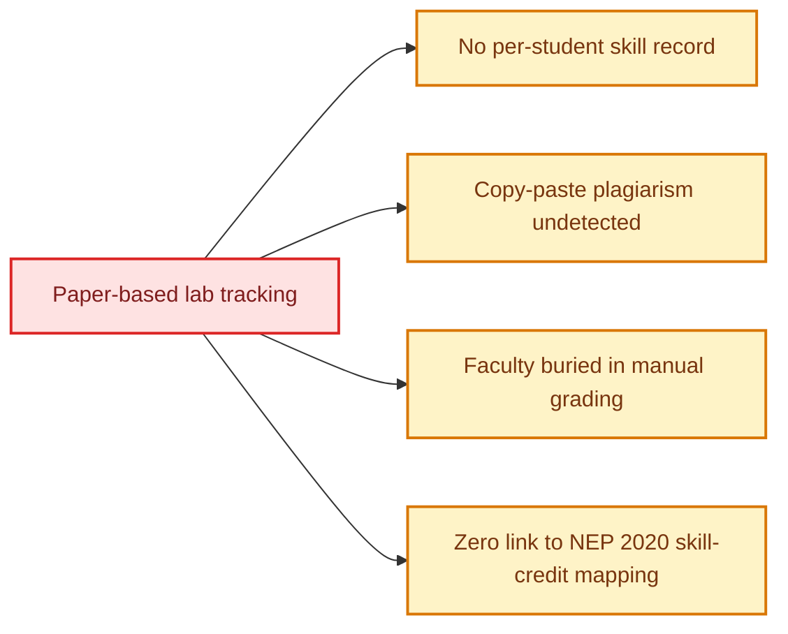
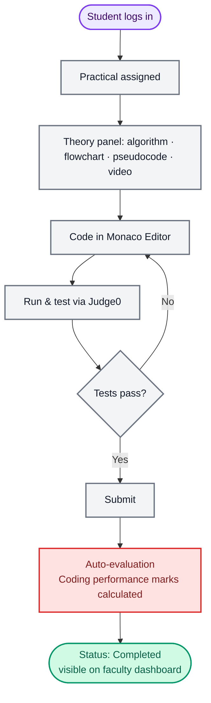
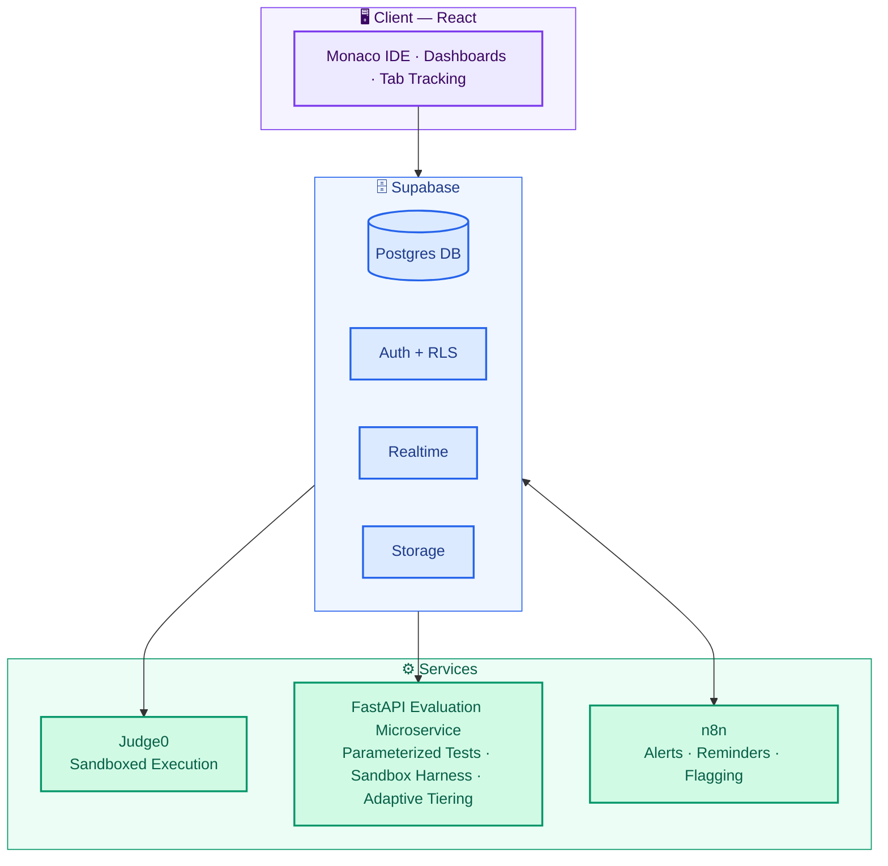
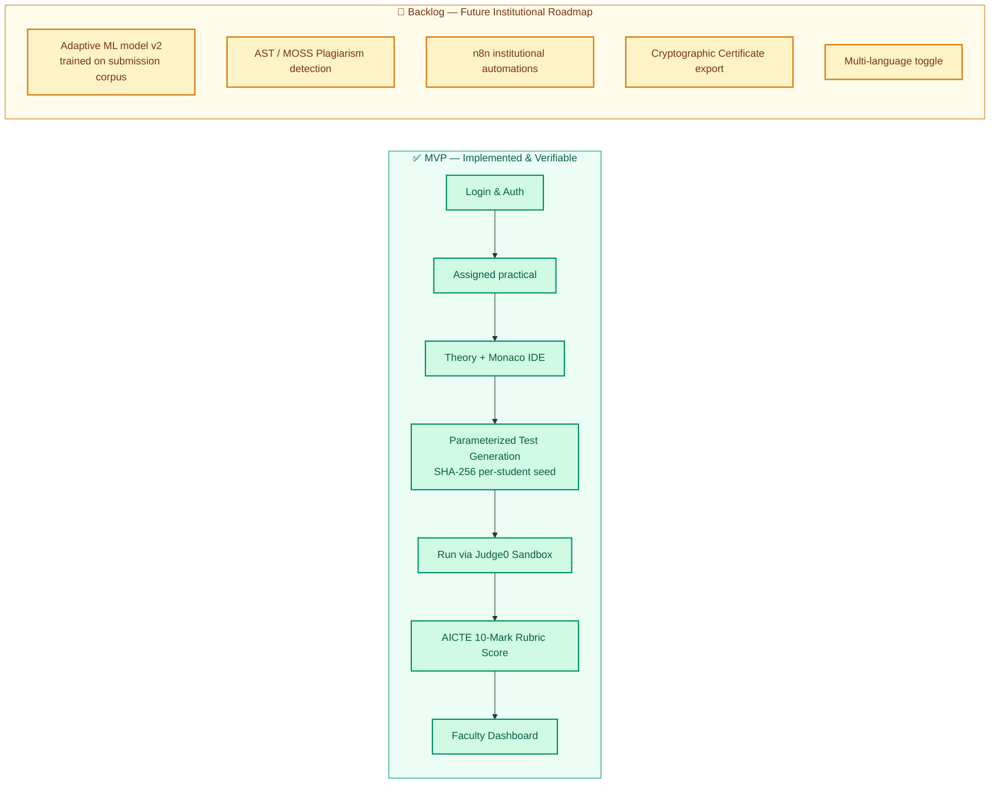
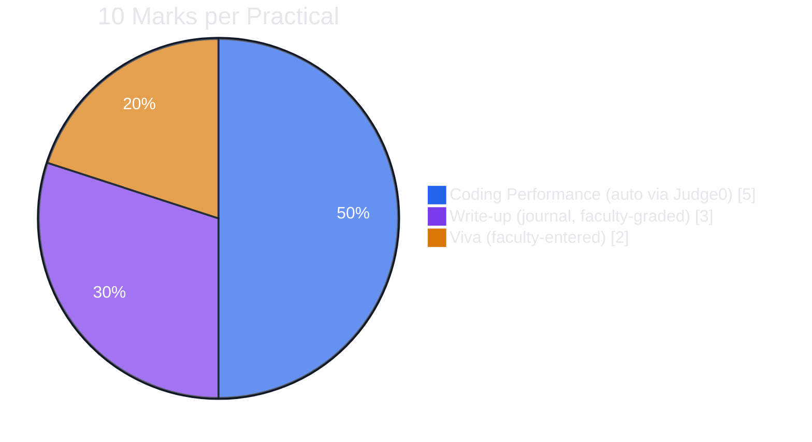
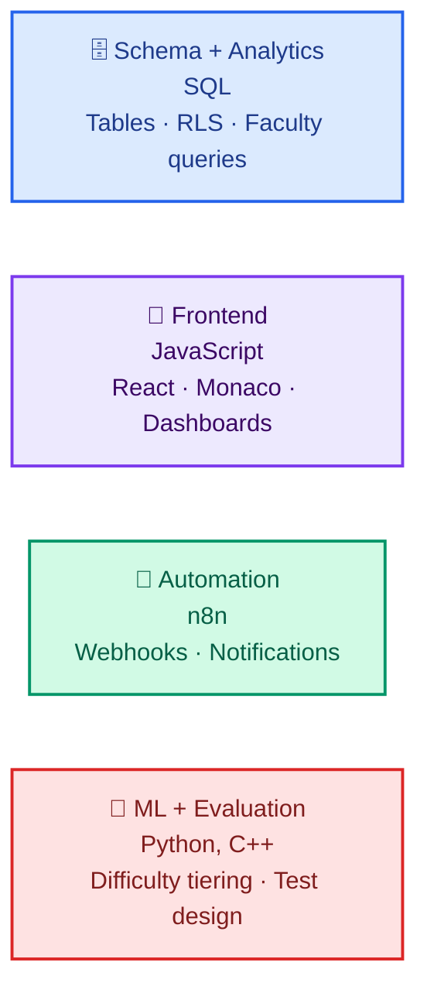

<div align="center">

# 🧪 Practical Lab Management Platform

### Lab Management · Coding Environment · Student Progress Analytics

**Smart India Hackathon 2026** &nbsp;•&nbsp; Problem Statement **SIH26207** &nbsp;•&nbsp; AICTE &nbsp;•&nbsp; Theme: *Smart Education*


</div>

---

> *"Student Innovation – Smart education: a concept that describes learning in the digital age, enabling learners to learn more effectively, efficiently, flexibly and comfortably."*
> — SIH26207, AICTE

## 🎯 The Problem

College practical labs are still run on paper journals and manual attendance. That breaks down in four specific ways:



We're turning lab practicals into a **tracked, individually-evaluated, and portable skill record** — built for one college first, designed to scale to any institution running structured lab courses.

## ⚡ What Makes This Different

Most coding-platform submissions stop at "auto-grade the code." We go a level deeper:

> **Every student gets parameterized test inputs for the same practical** — identical logic required, different data. A copy-pasted solution from a classmate simply fails its evaluation. It's a systems-level anti-cheating answer, not a UI restriction like disabling paste.

## 🗺️ Student Journey



## 🏗️ Architecture



## 🧩 Core Features

<table>
<tr>
<td width="33%" valign="top">

### 👨‍🎓 For Students
- Split-screen IDE: theory + Monaco editor
- Per-practical status tracking
- Instant test-case feedback
- Performance history & analytics
- *(backlog)* Shareable skill certificate

</td>
<td width="33%" valign="top">

### 👩‍🏫 For Faculty
- Batch + individual progress views
- Auto-filled coding performance marks
- Grading queue for write-up + viva
- Centralized submission records
- Audit trail on every grade

</td>
<td width="33%" valign="top">

### 🔒 Integrity by Design
- Parameterized per-student test data
- Continuous auto-save (no punitive erasing)
- Focus-loss logged, not auto-penalized
- *(backlog)* AST/MOSS plagiarism check

</td>
</tr>
</table>

## 🚦 Build Scope: MVP vs. Backlog

We're deliberately splitting what must work for any demo from what's a stretch goal — a working narrow slice beats a wide, half-built one.



> **Note on Engineering Transparency:**
> - **Parameterized Tests:** Built on deterministic cryptographic seeding (`SHA-256(student_id + practical_id + case_index)`) and algorithmic ground-truth solvers — **not ML/AI**. Every student receives distinct hidden test cases, but repeated attempts produce reproducible inputs.
> - **Adaptive Difficulty:** v1 is rule-based (attempt count, time-to-solve, pass rate) according to transparent AICTE rubric thresholds. A learned ML model comes in v2 once sufficient institutional telemetry exists. We value engineering honesty over inflated AI buzzwords.

## 🛠️ Tech Stack

Chosen to match the team's existing skills — no time burned learning new infra mid-hackathon.

| Layer | Tool | Why |
|---|---|---|
| 🗄️ Backend + DB + Auth | **Supabase** (Postgres, Auth, RLS, Realtime, Storage) | Relational data with clear foreign keys; RLS gives per-student/per-batch access control free |
| 🎨 Frontend | **React** | Talks directly to Supabase via its JS client |
| 💻 Code editor | **Monaco Editor** | Same engine as VS Code — drop-in |
| ▶️ Code execution | **Judge0** | Sandboxed execution, no custom sandbox to build |
| 🔁 Automation | **n8n** | Digests, reminders, flagging workflows |
| 🧠 ML (difficulty tiering) | **Python / FastAPI** | Small service behind a Supabase Edge Function |
| ⌨️ Compiled practicals | **C++** | DSA/OS lab test cases and evaluation logic |

**📈 Scaling:** self-hosted Judge0 works for a single-college demo; a managed cluster plus client-side execution (e.g. Pyodide) for simple/interpreted languages handles scale and flaky lab Wi-Fi.

**🔐 Privacy:** every query is scoped through Supabase Row Level Security — students see only their own data, faculty see only their assigned batches.

---

## 🚀 Quickstart: Running the Platform

### Prerequisites
- [Docker & Docker Compose](https://docs.docker.com/get-docker/) (v2.0+)
- [Node.js](https://nodejs.org/) (v18+)

### 1. One-Command Sandbox Stack (Recommended)
Run Judge0 CE (server, workers, postgres, redis) and the FastAPI backend together in Docker:

```bash
# 1. Copy example environment file
cp .env.docker.example .env

# 2. Edit .env with your Supabase credentials
# SUPABASE_URL=https://your-project.supabase.co
# SUPABASE_SERVICE_ROLE_KEY=your-service-role-key

# 3. Launch the container stack in detached mode
docker compose up -d
```

### 2. Verify Stack Health
Wait a few seconds for the Judge0 server healthcheck to pass, then verify both services:

```bash
# Check container status and health
docker compose ps

# Verify FastAPI and Judge0 connectivity
curl http://localhost:8000/health
```

Expected response:
```json
{
  "status": "healthy",
  "judge0": {
    "status": "reachable",
    "url": "http://judge0-server:2358",
    "version": "1.13.0",
    "execution_mode": "judge0_sandbox"
  }
}
```

### 3. Start the Frontend (Local)
The Vite client runs locally outside Docker:

```bash
cd client
npm install
npm run dev
```
Open **http://localhost:5173** in your browser.

---

### 🌐 Alternative Setup: Cloud RapidAPI Fallback
If running on a machine without Docker:
1. Set up a [RapidAPI Judge0 CE account](https://rapidapi.com/hermanzdosilovic/api/judge0-ce).
2. In `server/.env`:
   ```ini
   JUDGE0_API_URL=https://judge0-ce.p.rapidapi.com
   JUDGE0_API_KEY=your-rapidapi-key
   JUDGE0_API_HOST=judge0-ce.p.rapidapi.com
   ```
3. Run FastAPI locally: `cd server && pip install -r requirements.txt && python main.py`

---

### 🛡️ Security Architecture & Container Privileges

- **Environment-Driven Secrets**: All secrets (PostgreSQL, Redis, Supabase, Judge0) are injected via environment variables defined in `.env` (kept outside Git). No default passwords are baked into `docker-compose.yml` or `judge0.conf`.
- **Why Judge0 Containers Require `privileged: true`**:
  - Judge0 relies on [isolate](https://github.com/ioi/isolate) (the competitive programming sandbox) to safely execute student submissions.
  - `isolate` requires direct Linux kernel facilities to create nested User, PID, and Mount namespaces, as well as managing cgroup memory and CPU limits (`/sys/fs/cgroup`).
  - In containerized environments, creating these nested sandboxes requires `privileged: true` (or exhaustive host-level cgroup v2 mounting and system capabilities). Removing privileged mode results in `isolate: clone(): Operation not permitted` or cgroup access denial.
  - **Defense in Depth**: Untrusted code does *not* run as root; `isolate` drops privileges to an isolated sandbox user. The database, Redis, and FastAPI containers run strictly unprivileged on a dedicated internal Docker network (`edulabs-net`).

---

## 📝 Marks Distribution

Matches the college's existing 10-mark practical structure — this isn't a hypothetical grading model, it's grounded in a real requirement.



| Component | Marks | How it's scored |
|---|---|---|
| ⚙️ Coding Performance | 5 | Auto-calculated from Judge0 test-case pass rate, faculty-overridable |
| ✍️ Write-up | 3 | Structured journal (Aim/Algorithm/Code/Output/Conclusion); faculty-entered, platform shows a completeness checklist |
| 🗣️ Viva | 2 | Faculty-entered; platform can auto-suggest questions from theory content |

## 👥 Team Roles



## 🛡️ Anti-Cheat Philosophy

We chose **detect and inform**, not **punish automatically**:

- ❌ No auto-erasing code on tab switch — code auto-saves continuously
- ❌ No auto-lowering rank from tab-switch count — focus-loss is logged for faculty to *review*, not auto-penalize
- ✅ Tab detection only fires on leaving the browser entirely — navigating to the in-platform theory/video panel doesn't trigger it
- ✅ Primary defense is **real parameterized per-student test data** — a systems-level technical answer, not a fragile UI restriction that devtools can bypass

### 🧪 Real Parameterized Test Case Implementation

1. **Deterministic Seeding (`student_id + practical_id`)**:
   - Seed is derived server-side via `SHA-256(student_id::practical_id::case_idx)`.
   - Produces reproducible inputs for the same student across re-attempts.
   - Generates distinct, high-entropy test vectors for different students on the same practical.
2. **Multi-Factor Canonical Practical Resolution**:
   - Practicals are resolved by canonical ID slugs, title semantics, and subject code rather than `practical_number` alone.
   - Safely disambiguates duplicate practical numbers across seed revisions (e.g. `practical_number=1` as Linked List vs BST vs Array Max).
   - If an evaluation request specifies an unmapped or unknown practical, the engine raises an explicit `HTTP 422 Unprocessable Entity` error rather than silently defaulting to Practical 01 or 10.
3. **Ground-Truth Algorithmic Solvers**:
   - Covers all 10 canonical practicals in CS201P (and recognized syllabus variants).
   - Expected outputs are computed dynamically by reference solvers — never hardcoded dummy strings.
4. **Zero-Leakage Privacy**:
   - Pre-execution: Student APIs and database RLS policies only expose `is_sample = true` public test cases.
   - Post-execution: Hidden parameterized test case inputs and expected outputs are redacted from response payloads, preventing extraction via browser network devtools while providing truthful pass/fail badges, telemetry, and marks.
5. **Copy-Paste Defeat**:
   - A student submitting hardcoded `if input == sample: print(...)` logic passes public sample cases but fails the per-student parameterized hidden cases. Classmate solution swapping fails immediately.

### 📚 Canonical CS201P Syllabus & Parameterized Test Registry

| Practical | Canonical Title | Algorithmic Topic | Generator Contract |
| :--- | :--- | :--- | :--- |
| **P01** | Singly Linked List Implementation & Operations | Linear Structures | Dynamic list traversal (`N` elements) |
| **P01 (Var)** | Find the Largest Number in an Array | Array Scans | Running maximum invariant (`max(arr)`) |
| **P02** | Stack Implementation & Balanced Parentheses | Stacks & Parsing | Bracket validation (`VALID` / `INVALID`) |
| **P02 (Var)** | Implement Stack Using Array | Array Stacks | `PUSH`, `POP`, `PEEK` with underflow/overflow |
| **P03** | Circular Queue & Priority Queue Scheduling | FIFO Buffers | Queue operations with modular wrap-around |
| **P04** | Binary Search Tree (BST) Insertion & Inorder | Trees & Invariants | BST insertion and strictly sorted inorder |
| **P05** | AVL Tree: Height-Balanced Binary Search Tree | Self-Balancing Trees | LL/RR/LR/RL rotations with balance factor in [-1, 0, 1] |
| **P06** | Graph Traversal: BFS & DFS | Graph Search | Queue-based BFS starting at vertex 0 |
| **P07** | Dijkstra Algorithm: Single-Source Shortest Path | Greedy Algorithms | Non-negative weighted shortest paths from source 0 |
| **P08** | Minimum Spanning Tree (MST): Kruskal & Prim | Greedy & Disjoint Sets | Kruskal's DSU total spanning tree weight |
| **P09** | Hash Table with Open Addressing & Collision | Hashing & Probing | Modulo hashing with sequential linear probing |
| **P10** | Empirical Complexity Analysis: QuickSort vs MergeSort | Divide & Conquer | O(N log N) sorted benchmark output |

> **Fail-Fast Integrity**: If an evaluation request specifies an unrecognized practical ID or title, the backend returns an explicit `HTTP 422 Unprocessable Entity` with diagnostic error details instead of silently running a mismatched generator.

---

<div align="center">

Built for **Smart India Hackathon 2026** · Problem Statement **SIH26207** (AICTE, Smart Education)

</div>
