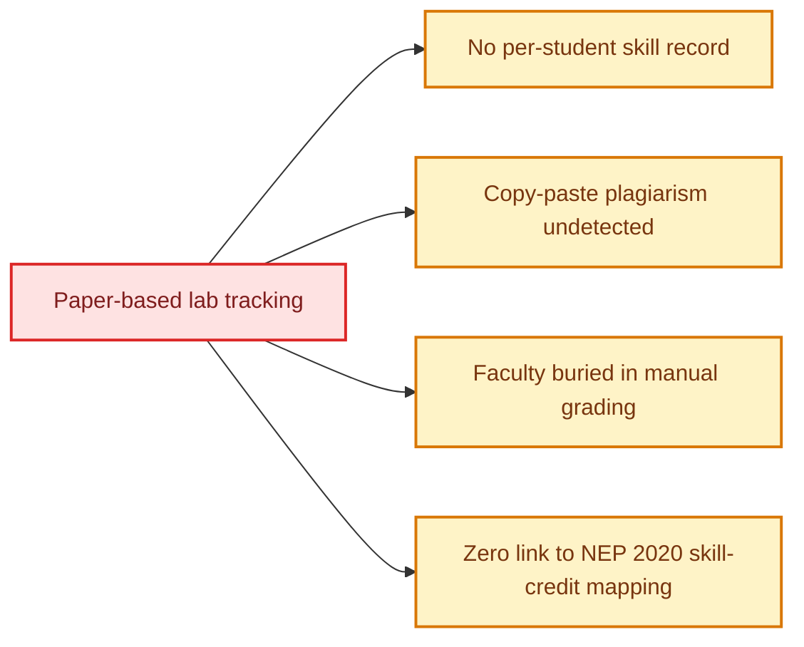
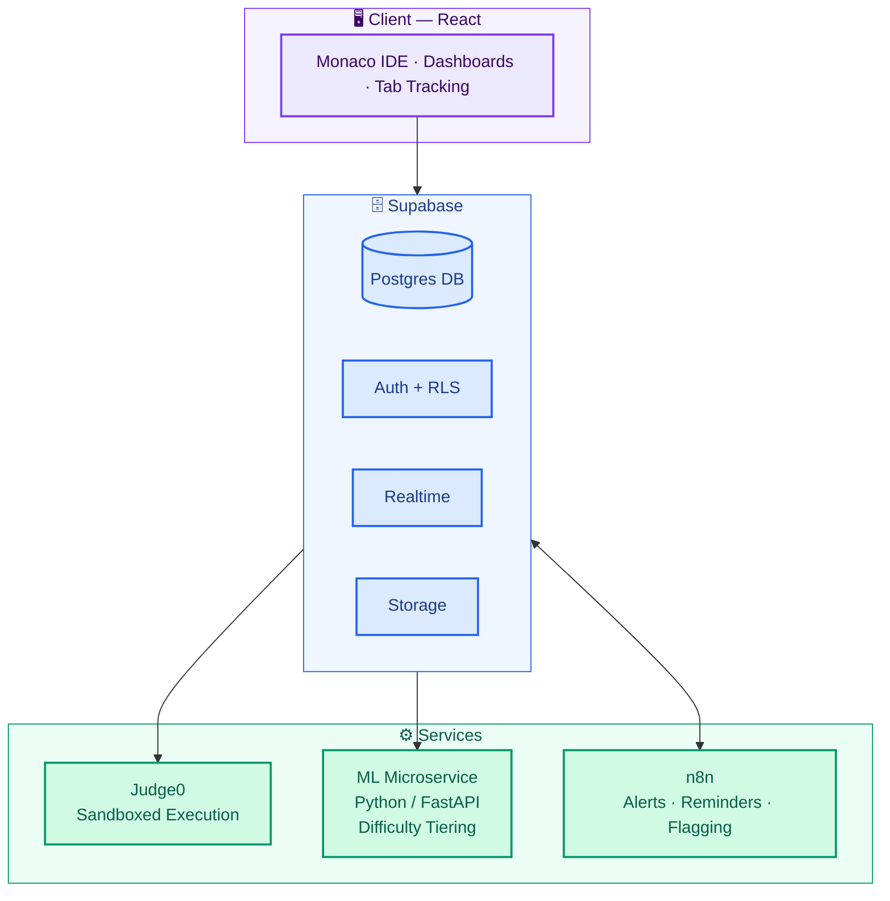
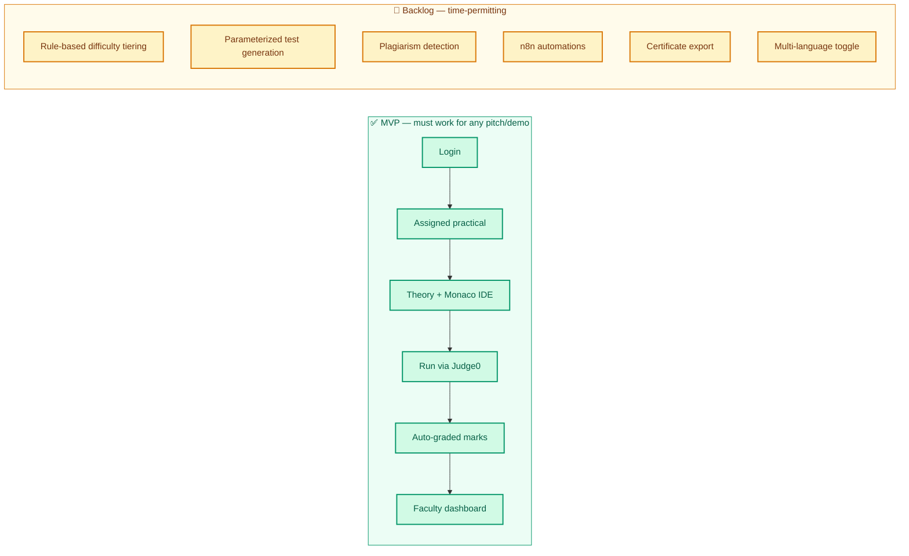
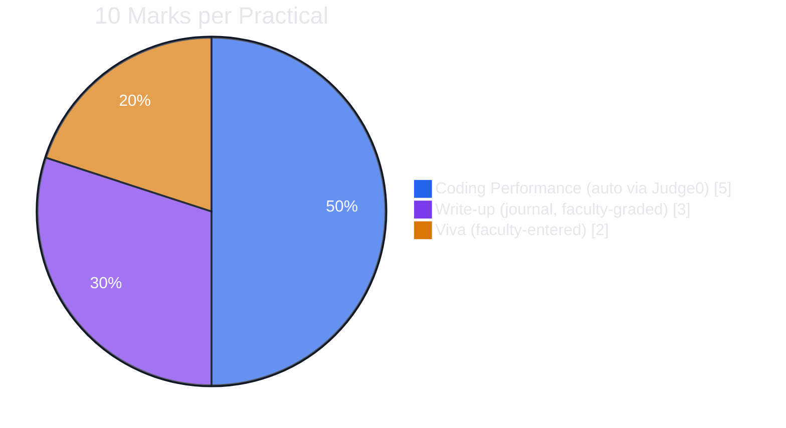
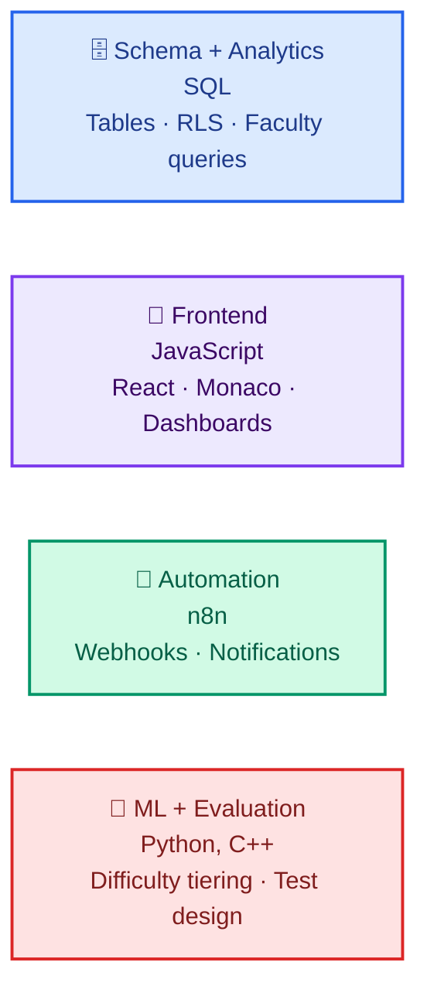

# 🧪 Practical Lab Management Platform

### Lab Management · Coding Environment · Student Progress Analytics

**Smart India Hackathon 2026** &nbsp;•&nbsp; Problem Statement **SIH26207** &nbsp;•&nbsp; AICTE &nbsp;•&nbsp; Theme: *Smart Education*

---

> *"Student Innovation – Smart education: a concept that describes learning in the digital age, enabling learners to learn more effectively, efficiently, flexibly and comfortably."*
> — SIH26207, AICTE

## 🎯 The Problem

College practical labs are still run on paper journals and manual attendance. That breaks down in four specific ways:

We're turning lab practicals into a **tracked, individually-evaluated, and portable skill record** — built for one college first, designed to scale to any institution running structured lab courses.

## ⚡ What Makes This Different

Most coding-platform submissions stop at "auto-grade the code." We go a level deeper:

> **Every student gets parameterized test inputs for the same practical** — identical logic required, different data. A copy-pasted solution from a classmate simply fails its evaluation. It's a systems-level anti-cheating answer, not a UI restriction like disabling paste.

## 🗺️ Student Journey

## 🏗️ Architecture

## 🧩 Core Features

<table>
<tr>
<td width="33%" valign="top">

### 👨‍🎓 For Students
- Split-screen IDE: theory + Monaco editor
- Per-practical status tracking
- Instant test-case feedback
- Performance history & analytics
- *(backlog)* Shareable skill certificate

</td>
<td width="33%" valign="top">

### 👩‍🏫 For Faculty
- Batch + individual progress views
- Auto-filled coding performance marks
- Grading queue for write-up + viva
- Centralized submission records
- Audit trail on every grade

</td>
<td width="33%" valign="top">

### 🔒 Integrity by Design
- Parameterized per-student test data
- Continuous auto-save (no punitive erasing)
- Focus-loss logged, not auto-penalized
- *(backlog)* AST/MOSS plagiarism check

</td>
</tr>
</table>

## 🚦 Build Scope: MVP vs. Backlog

We're deliberately splitting what must work for any demo from what's a stretch goal — a working narrow slice beats a wide, half-built one.

> **Note on "adaptive difficulty":** v1 is rule-based (attempt count, time-to-solve, pass rate) — not ML yet, and we say so plainly. A real model comes in v2 once enough submission data exists. We'd rather be honest about this than overclaim AI to judges.

## 🛠️ Tech Stack

Chosen to match the team's existing skills — no time burned learning new infra mid-hackathon.

| Layer | Tool | Why |
|---|---|---|
| 🗄️ Backend + DB + Auth | **Supabase** (Postgres, Auth, RLS, Realtime, Storage) | Relational data with clear foreign keys; RLS gives per-student/per-batch access control free |
| 🎨 Frontend | **React** | Talks directly to Supabase via its JS client |
| 💻 Code editor | **Monaco Editor** | Same engine as VS Code — drop-in |
| ▶️ Code execution | **Judge0** | Sandboxed execution, no custom sandbox to build |
| 🔁 Automation | **n8n** | Digests, reminders, flagging workflows |
| 🧠 ML (difficulty tiering) | **Python / FastAPI** | Small service behind a Supabase Edge Function |
| ⌨️ Compiled practicals | **C++** | DSA/OS lab test cases and evaluation logic |

**📈 Scaling:** self-hosted Judge0 works for a single-college demo; a managed cluster plus client-side execution (e.g. Pyodide) for simple/interpreted languages handles scale and flaky lab Wi-Fi.

**🔐 Privacy:** every query is scoped through Supabase Row Level Security — students see only their own data, faculty see only their assigned batches.

## 📝 Marks Distribution

Matches the college's existing 10-mark practical structure — this isn't a hypothetical grading model, it's grounded in a real requirement.

| Component | Marks | How it's scored |
|---|---|---|
| ⚙️ Coding Performance | 5 | Auto-calculated from Judge0 test-case pass rate, faculty-overridable |
| ✍️ Write-up | 3 | Structured journal (Aim/Algorithm/Code/Output/Conclusion); faculty-entered, platform shows a completeness checklist |
| 🗣️ Viva | 2 | Faculty-entered; platform can auto-suggest questions from theory content |

## 👥 Team Roles

## 🛡️ Anti-Cheat Philosophy

We chose **detect and inform**, not **punish automatically**:

- ❌ No auto-erasing code on tab switch — code auto-saves continuously
- ❌ No auto-lowering rank from tab-switch count — focus-loss is logged for faculty to *review*, not auto-penalize
- ✅ Tab detection only fires on leaving the browser entirely — navigating to the in-platform theory/video panel doesn't trigger it
- ✅ Primary defense is **parameterized per-student test data** — a real technical answer, not a UI restriction that devtools can bypass

---

Built for **Smart India Hackathon 2026** · Problem Statement **SIH26207** (AICTE, Smart Education)

